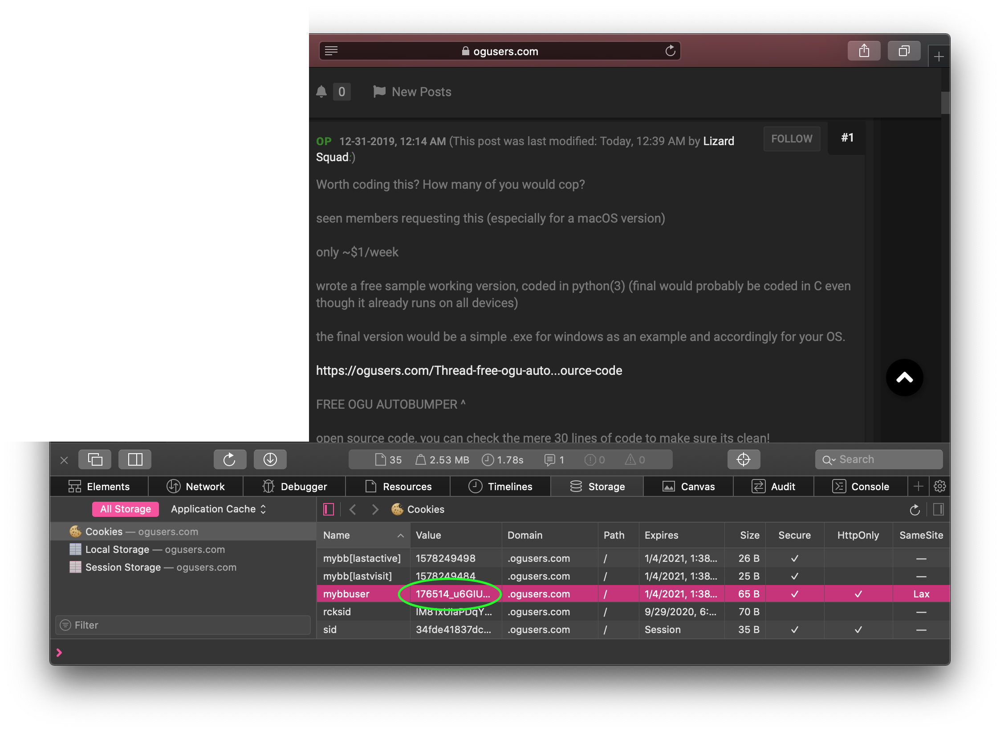
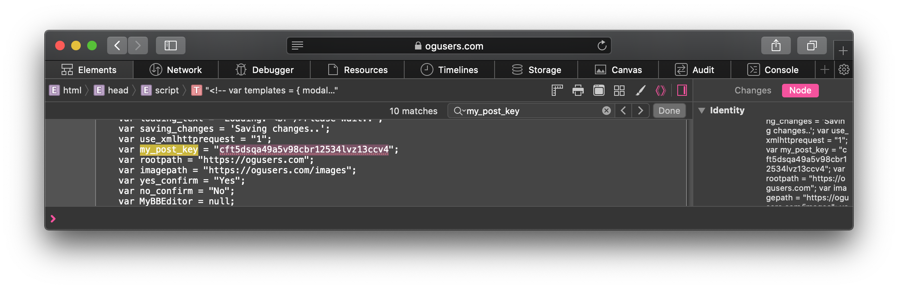
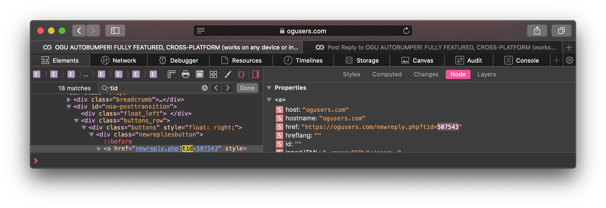

😷 ogu autobumper prototype

make sure you have python3 installed (along with the default requests module)

copy and paste or download ogu.py

edit variables in ogu.py (photo tutorial below using inspect element)

save it and run `python3 ogu.py`

minimize/leave running to autobump your thread(s)!

remember, this is merely an example prototype.

